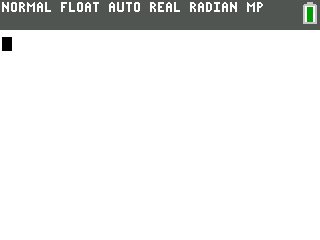

## CEleste

A Celeste Classic port for the TI-84+CE and TI-83PCE graphing calculators.

### Usage
*(A video tutorial for the following steps is also available
[here](https://www.youtube.com/watch?v=_e8pgw9d7S4))*

Transfer [CELESTE.8xp](https://github.com/commandblockguy/CEleste/releases/latest/download/CEleste.8xp)
and the [C Libraries](https://tiny.cc/clibs) to the calculator using TI Connect CE
or TiLP. Then, select prgmCELESTE from the program menu and press enter.
If this results in an error, [arTIfiCE](https://yvantt.github.io/arTIfiCE/) is
required for your OS version.

Use the arrow keys to move, 2nd to jump and alpha to dash. To exit the game, press
the clear key.

### Compiling
To build this repository from source, the [CE C Toolchain](https://github.com/CE-Programming/toolchain)
is required. After installing the toolchain, clone this repository and run `make gfx`
inside it to generate the graphics data, and then `make` to compile. The output .8xp
can be found in the `bin/` directory.

### Credits
Based on [Celeste Classic](https://mattmakesgames.itch.io/celesteclassic) by Maddy
Thorson and Noel Berry. C++ calculator port by John "commandblockguy" Cesarz.
